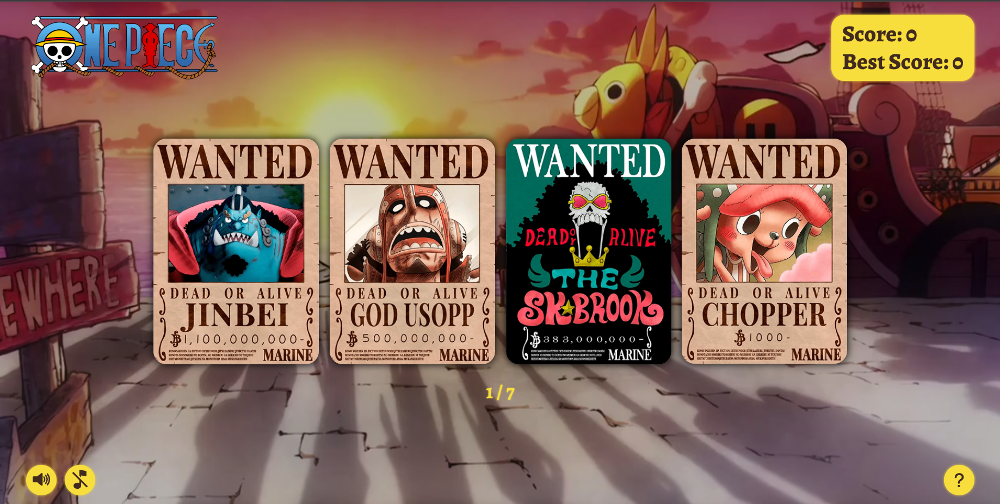

# Memory Card Game

A single-page memory card game built with React, designed to practice component-based architecture, state management, and asynchronous asset loading. The app allows users to play a memory game with characters, track scores, and see a game over screen with win/lose conditions, focusing on clean UI and smooth gameplay.

## Preview



**Live Demo:**

* GitHub Pages | [Memory-Card](https://wrzdx.github.io/Memory-Card/)


## Features

* Memory card gameplay with multiple difficulty levels
* Dynamic score tracking and best score recording
* Component-based architecture with React
* Smooth card flipping and animations
* Responsive layout for desktop and mobile devices
* Game over screen with win/lose messages

## How to Run

1. Clone the repository:

```bash
git clone https://github.com/wrzdx/Memory-Card.git
```

2. Install dependencies:

```bash
npm install
```

3. Start development server:

```bash
npm run dev
```

4. Open `http://localhost:5173` in your browser

For production build:

```bash
npm run build
```

---

*Part of The Odin Project's Full Stack JavaScript Curriculum*
*Focuses on React fundamentals, state management, interactive UI design*
